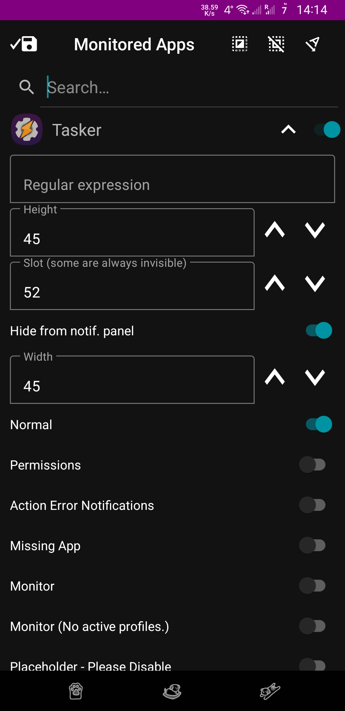
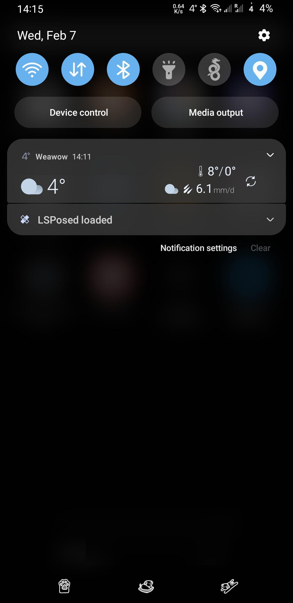
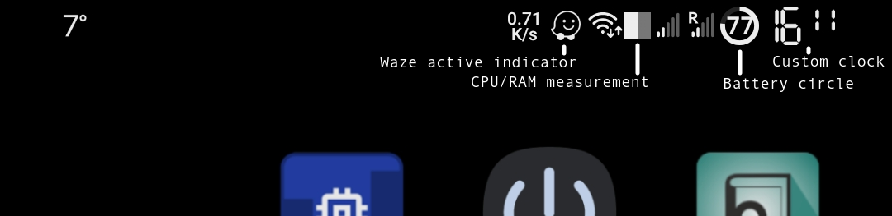

Statusbar Icon Relocator
===========

This module allows you to move selected notification icons from the left side of the statusbar into its right side - where the system status icons are normally located. The corresponding notifications can be also optionally removed from the notification panel.

Why? Because I wanted to have the battery in circle again and I was annoyed with custom ROMs seemingly dropping this altogether.

The application was tested only on Android 11/12 AOSP and OneUI.

Discussion/Support: [XDA thread](https://xdaforums.com/t/mod-xposed-statusbar-notification-icon-relocator.4655159/)

LSPosed Repository: [Release](https://modules.lsposed.org/module/net.lonelytransistor.notificationinsystem)

**Setup**

Seems arbitrary, but the app requires access to notifications as well as access to a random device to become a Device Manager and access the notification categories. After that step, the configuration is easy - just expand the requested app, select notification categories you want, add a regex filter or not, declare the icon size and select the icon's new position in the SystemUI. The slot index should be positive and not exceed a certain device dependant value, which you have to guess. In case of OneUI this value is 53, which corresponds to the clock's slot. There are many more slots, some completely unpopulated.

**Screenshots:**

**Suggested usage**

While useful in itself, the suggested usage is in conjunction with Tasker and its notifications.

As an example you can see my own configuration as a screenshot above. This config can be achieved by downloading my Tasker xml profile [here](TaskerProfile.prj.xml) and setting the following settings within the module (note that the notification categories in Tasker only get created after its notification shows up at least once):

- Tasker
    - SystemUI small
        - slot: 48
        - width: 36
        - height: 36
    - SystemUI tiny
        - slot: 48
        - width: 16
        - height: 32
    - SystemUI wide
        - slot: 53
        - width: 92
        - height: 47
    - SystemUI
        - slot: 52
        - width: 47
        - height: 47

License
-------

Licensed under the MIT License
