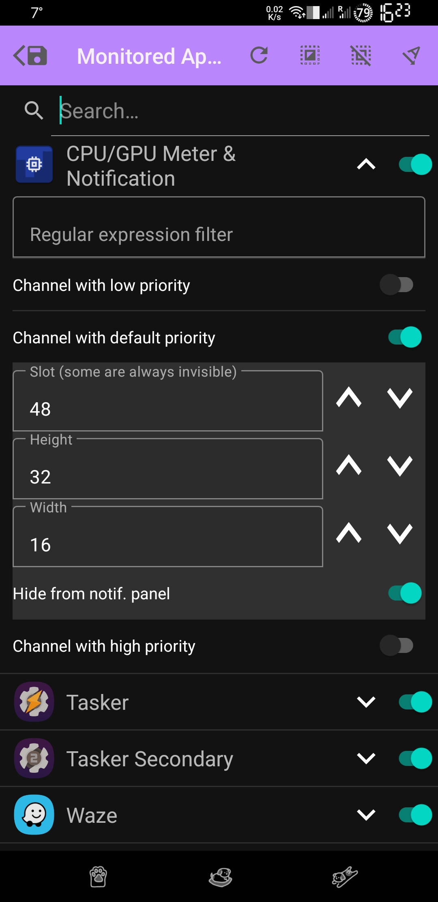
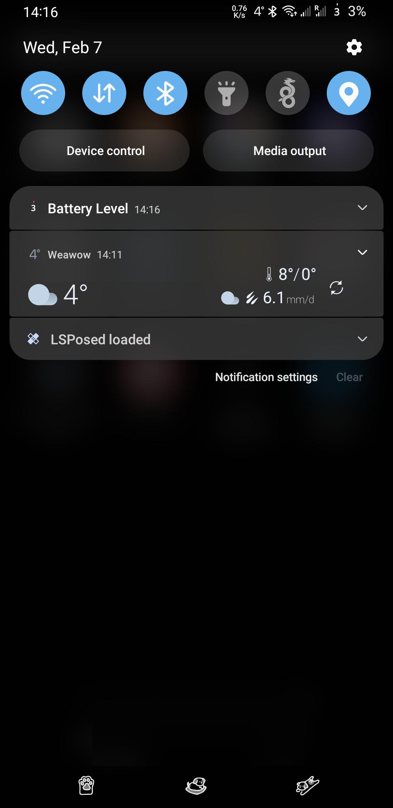

**SystemUI Notifier**
===========

This module allows you to move certain notification icons into the right side of the SystemUI's statusbar, where the system icons are normally located. The corresponding notifications can be also optionally removed from the notification panel.

Why? Because I wanted to have the battery in circle again and I was annoyed with custom ROMs seemingly dropping this altogether.

**Setup:**

Seems arbitrary, but the app requires access to notifications as well as access to a random device to become a Device Manager and access the notification categories. After that step, the configuration is easy - just expand the requested app, select notification categories you want, add a regex filter or not, declare the icon size and select the icon's new position in the SystemUI. The slot index should be positive and not exceed a certain device dependant value, which you have to guess.

---

**Discussion/Support:**
[XDA thread](https://xdaforums.com/t/mod-xposed-systemui-notifier.4655159)

**Compatibility:**

The application was tested only on Android 11 AOSP, Android 11, 12 OneUI.

This module is provided as is without any promise of support. But I do welcome pull requests.

**My config**

The tasker profile accomplishing the battery circle and more is within the repo: [TaskerProfile.prj.xml](/TaskerProfile.prj.xml)
The settings of this module for the config is:

- SystemUI small : Slot: 48, Size: 36x36
- SystemUI tiny : Slot: 48, Size: 16x32
- SystemUI wide : Slot: 53, Size: 92x47
- SystemUI: Slot: 52, Size: 47x47

**Screenshots:**

License
-------

Licensed under the MIT License
